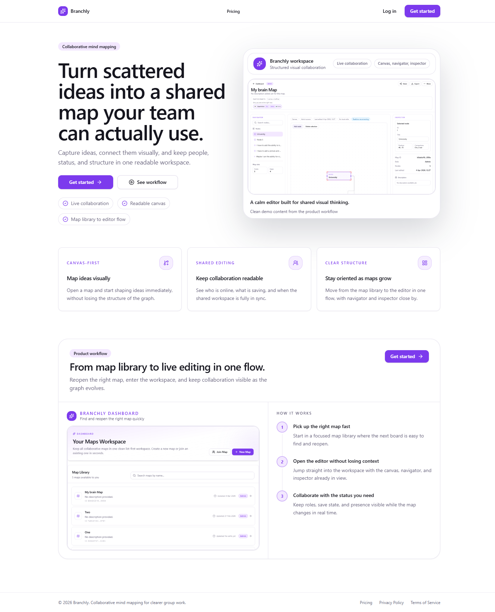
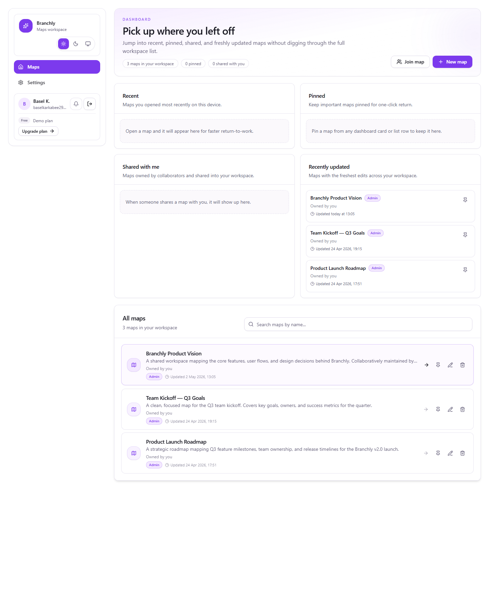
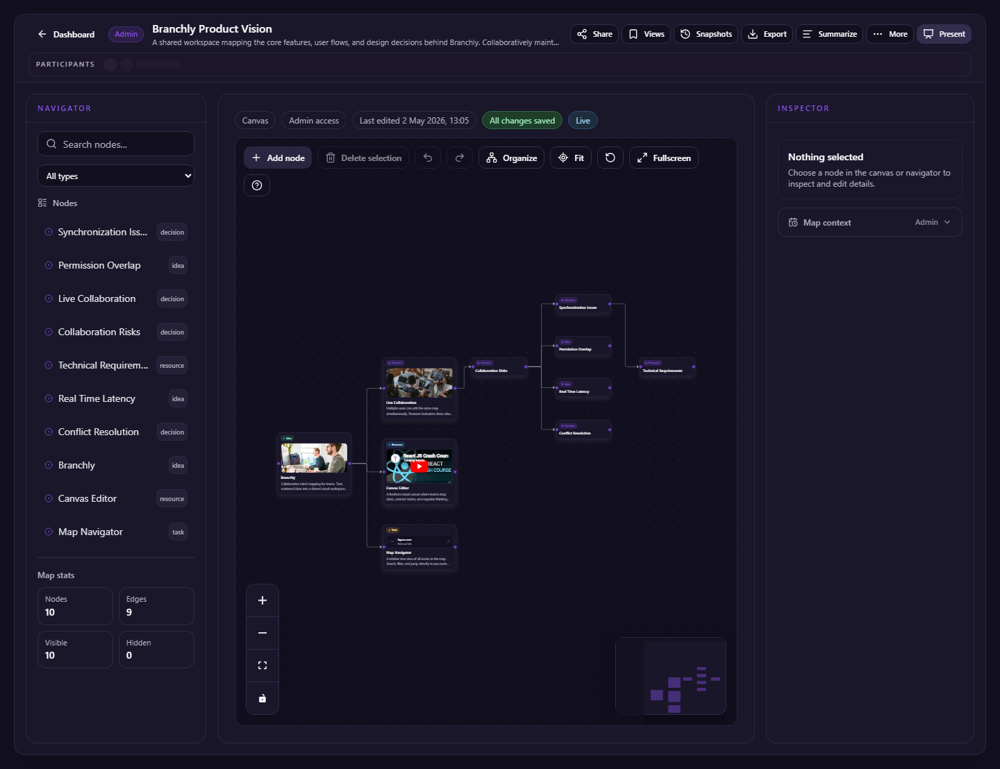
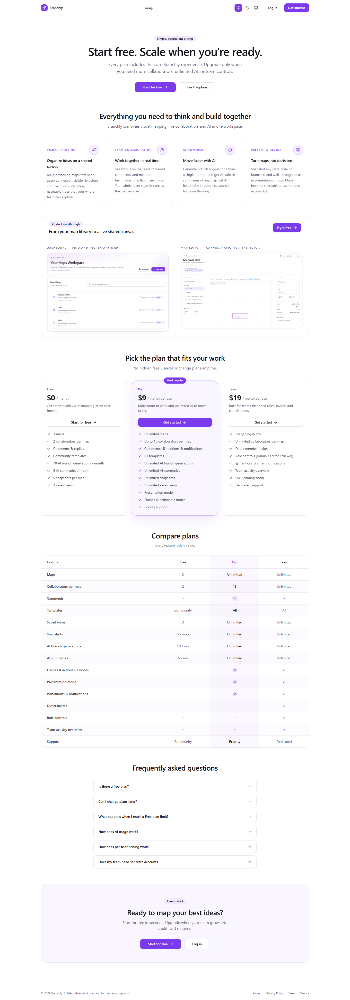
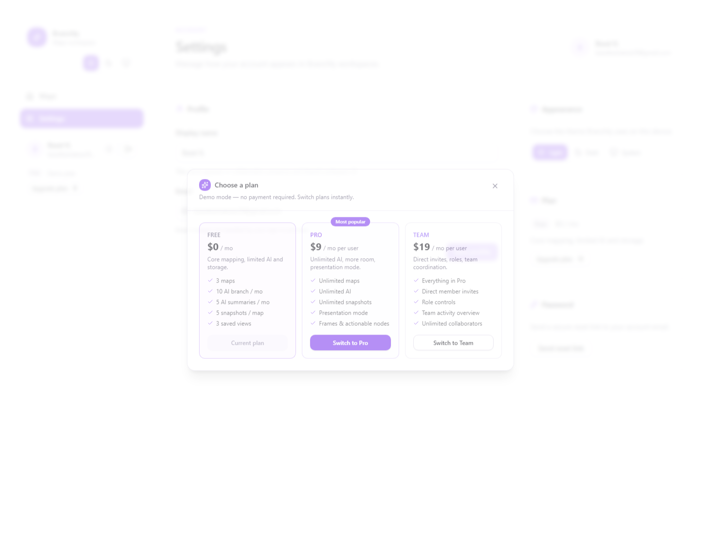
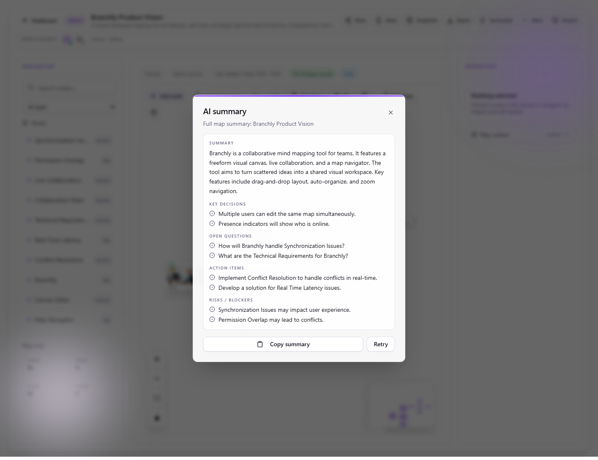

# Branchly

Branchly is a collaborative visual thinking workspace for turning scattered ideas into shared maps. The active app lives in `client-v3/` and combines a map editor, live collaboration, comments and mentions, AI-assisted branching and summarization, plus a presentation-ready demo pricing flow.


## Screenshots

| Landing | Dashboard |
| --- | --- |
|  |  |
| Workspace (dark mode) | Pricing |
|  |  |
| Upgrade modal | AI summary |
|  |  |

## Features

- Collaborative map creation and editing with drag-and-drop nodes, custom edges, media, map descriptions, auto-organize, zoom/fit controls, and duplicate-map support.
- Real-time workspace presence through Supabase Realtime, including live cursors, participant presence, and shared editing status.
- Dashboard sections for recent, pinned, shared-with-me, and recently updated maps, plus search and quick reopen flows.
- Templates and built-in branch starters for faster map creation and structured branching.
- Comments and `@mentions` on nodes, with notification UI and best-effort real-time notification delivery.
- Direct member invites and role-based collaboration controls are implemented in the UI, but the `map_invites` / notification SQL checkpoint must be applied manually before those flows work end to end.
- Saved views, presentation/focus mode, and in-map navigation for walking teams through a map as a demo or working session.
- Version snapshots and restore flows for point-in-time map capture.
- Command palette access, batch selection actions, export, and workspace utilities for faster editing.
- Frames/groups for organizing clusters of nodes visually.
- Actionable nodes with owner, status, priority, and voting metadata.
- AI branch generation with Groq-backed edge functions.
- AI map and branch summarization with structured sections for summary, decisions, questions, actions, and risks.
- Demo pricing and upgrade flows for Free, Pro, and Team plans, plus light and dark mode across the active product.

## Tech Stack

- React 18
- Vite
- TypeScript
- Tailwind CSS
- Supabase Auth, Postgres, Realtime, and Storage
- Supabase Edge Functions
- Groq API for AI generation and summarization
- Playwright for end-to-end and smoke testing

## Project Structure

- `client-v3/` — active Branchly frontend application
- `client-v3/src/` — app source, routes, shared UI, and feature entry points
- `client-v3/src/features/` — feature-oriented code grouped by domain such as auth, maps, map editor, workspace, notifications, and demo plan
- `client-v3/src/components/` — reusable layout and UI composition
- `client-v3/src/lib/` — shared services, Supabase client wiring, AI service boundaries, and demo plan helpers
- `supabase/` — Supabase project config, checked-in migrations, seed data, and edge functions
- `supabase/functions/` — `generate-branch` and `summarize-map` edge functions
- `supabase/migrations/` — checked-in schema migrations for the active Branchly database
- `docs/` — implementation checkpoints, deployment notes, and manual setup references

## Local Setup

### 1. Install dependencies

```bash
npm install
```

### 2. Configure client environment

```bash
cp client-v3/.env.example client-v3/.env.local
```

Set these values in `client-v3/.env.local`:

- `VITE_SUPABASE_URL`
- `VITE_SUPABASE_ANON_KEY`
- `E2E_ADMIN_EMAIL`
- `E2E_ADMIN_PASSWORD`
- `E2E_VIEWER_EMAIL`
- `E2E_VIEWER_PASSWORD`

The `E2E_*` values are only for Playwright and are not used by the production app runtime.

### 3. Run the app

```bash
# From the repo root
npm run dev:v3

# Or directly
cd client-v3
npm run dev
```

The Vite app runs at `http://localhost:5173`.

### 4. Optional local Supabase CLI workflow

If you want to run against a local Supabase stack instead of a hosted project:

```bash
supabase start
supabase db reset
```

Then point `client-v3/.env.local` at the local Supabase URL and anon key reported by the CLI. For a linked remote project, use your normal Supabase CLI flow such as `supabase db push`.

### 5. Typecheck and build

```bash
cd client-v3
npm run typecheck
npm run build
```

## Environment Variables and Secrets

- `client-v3/.env.local` holds the browser-safe `VITE_SUPABASE_URL` and `VITE_SUPABASE_ANON_KEY`.
- Never put service-role keys, database passwords, or Groq secrets in `VITE_*` variables.
- `GROQ_API_KEY` must be stored server-side as a Supabase Edge Function secret.
- `GROQ_MODEL` is optional and can override the default Groq model for AI functions.
- Playwright account credentials live in `client-v3/.env.local` as `E2E_*` variables for test runs only.

## Supabase Setup

Branchly uses the checked-in migrations under `supabase/migrations/` for the main app schema. Typical workflows:

```bash
# Local reset/apply
supabase db reset

# Linked remote project
supabase db push
```

Edge functions live under `supabase/functions/` and should be deployed separately from schema changes.

### Manual collaboration SQL note

Direct email invites and notification-backed invite acceptance depend on the SQL checkpoint in:

```text
docs/migrations/20260502000000_collaboration_infrastructure.sql
```

That file is currently documented as a manual setup step and is not part of `supabase/migrations/*`. If you need `map_invites`, invite acceptance, or notification RPC support, apply that SQL manually in Supabase before using those flows. This cleanup pass intentionally does not move or apply it.

## AI Setup

Branchly ships two AI-related edge functions:

- `supabase/functions/generate-branch`
- `supabase/functions/summarize-map`

Set the Groq secret server-side and deploy both functions:

```bash
supabase secrets set GROQ_API_KEY=gsk_...
supabase functions deploy generate-branch
supabase functions deploy summarize-map
```

Optional model override:

```bash
supabase secrets set GROQ_MODEL=llama-3.3-70b-versatile
```

Current AI behavior:

- AI branch generation creates subtree suggestions from a selected node.
- AI summary can summarize a full map or a downstream branch.
- Both edge functions use in-memory rolling-window rate limiting at 20 requests per user per hour.
- The current rate limiting is per function instance, not globally shared across all instances.

## Demo Pricing and Plans

The pricing system in this repo is presentation-oriented, not production billing:

- Free, Pro, and Team plans are simulated in the client.
- Plan switching is stored locally with browser `localStorage`.
- Upgrade flows and feature gates are for demo/product presentation purposes.
- There is no Stripe integration, no real checkout, and no server-backed entitlements in this pass.

## Known Limitations

- Billing is demo-only. There is no real payment backend or subscription enforcement.
- Some feature gating is client-side only and is not a hardened entitlement system.
- AI rate limiting is in-memory and per edge-function instance, so it is best treated as a soft abuse guard.
- Direct invite and invite-acceptance flows require the manual collaboration SQL checkpoint; without it, `map_invites`-backed features will fail.
- Saved views, snapshots, and per-node voting are currently browser-local state rather than shared server-backed records.
- This repo is not production-hardened for billing, abuse prevention, or all collaboration edge cases.

## Scripts

From the repo root:

- `npm run dev:v3` — run the active Branchly V3 app
- `npm run build:v3` — build the active Branchly V3 app

From `client-v3/`:

- `npm run dev` — start the Vite dev server
- `npm run build` — typecheck and build the app
- `npm run typecheck` — run `tsc -b --noEmit`
- `npm run lint` — run ESLint
- `npm run test:e2e` — run Playwright E2E tests
- `npm run test:smoke` — run the smoke subset of Playwright tests

## Roadmap

- Replace demo pricing with real billing and server-backed entitlements if the product moves beyond demos.
- Move AI limits to a shared backend counter for stronger rate limiting.
- Make snapshots, saved views, and voting server-backed where shared persistence matters.
- Harden invite flows and fold the collaboration SQL checkpoint into the normal migration path.
- Expand automated coverage across collaboration, AI, and mobile workflows.


